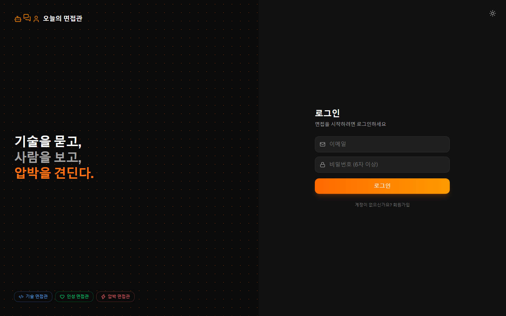
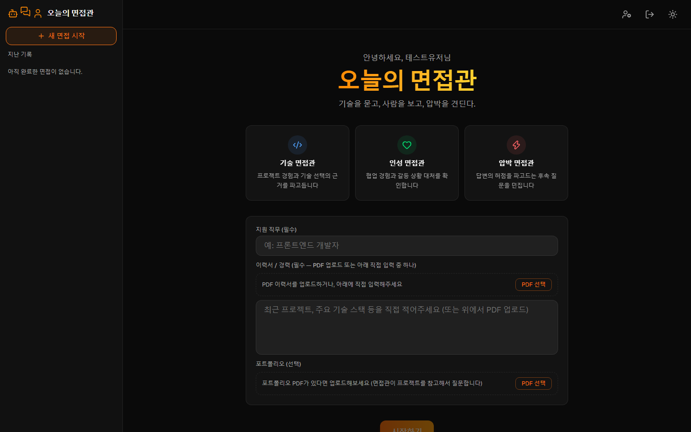
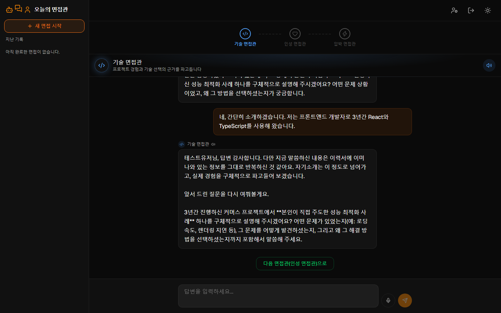
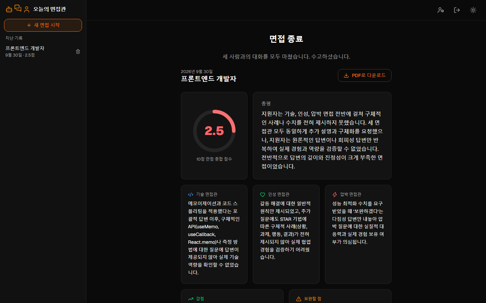
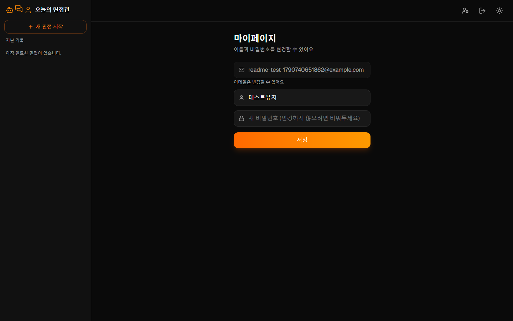

# 오늘의 면접관

기술을 묻고, 사람을 보고, 압박을 견딘다 — 세 명의 AI 면접관과 순서대로 진행하는 모의 면접 웹앱

성격이 다른 면접관 세 명(기술/인성/압박)이 순서대로 등장해 질문을 던지고, Claude가 실시간 스트리밍으로 답변한다.

## 스크린샷

### 로그인 / 회원가입

좌측엔 브랜딩, 우측엔 폼을 배치한 2열 레이아웃. 모바일에서는 브랜딩 화면을 먼저 보여주고 옆으로 밀면 폼으로 전환.



### 홈 화면 — 지원 정보 입력

회원가입 시 입력한 이름으로 인사말 표시. 지원 직무(필수)와 이력서(PDF 업로드 또는 직접 입력 중 하나, 필수)를 받아야 면접을 시작할 수 있어 두루뭉술한 질문을 방지. 포트폴리오 PDF는 선택 업로드.



### 면접 진행 — 실시간 스트리밍 + 음성 입출력

상단 스텝 인디케이터로 진행 상황 표시, 완료한 면접관은 눌러서 다시 돌아갈 수 있음. 질문은 타이핑되듯 스트리밍되고, 마이크로 답변을 받아쓰거나 면접관 질문을 음성으로 들을 수 있음(면접관마다 다른 톤).



### 종합 평가 리포트

세 면접관과의 대화가 끝나면 점수·총평·면접관별 피드백·강점·보완점을 구조화된 리포트로 생성. 리포트/대화 전문을 골라서 PDF로 다운로드 가능.



### 진행 중인 면접 이어서 진행

중간에 나가도 대화 내용이 DB에 남아있어서, 사이드바의 "진행 중인 면접"에서 이어서 진행할 수 있음.


### 마이페이지

비밀번호를 한 번 더 확인해야 진입 가능. 이름과 비밀번호 변경, 이메일은 변경 불가.



## 기술 스택

| 구분 | 기술 |
|---|---|
| 프레임워크 | Next.js 16 (App Router) + TypeScript |
| 스타일 | Tailwind CSS v4 |
| 아이콘 | lucide-react |
| 백엔드 | Next.js Route Handler (Node.js 런타임) |
| AI | Anthropic Claude API (`claude-sonnet-5`), 스트리밍 + 구조화된 출력(zod) |
| 음성 입출력 | Web Speech API (브라우저 내장 STT/TTS, 별도 서버·API 키 불필요) |
| DB / 인증 | Supabase (PostgreSQL, Auth, RLS) |
| PDF 생성 | html2canvas-pro + jsPDF (화면 캡처 방식) |

## 주요 기능

- **로그인 (Supabase Auth)** — 이메일/비밀번호 회원가입·로그인, 본인 세션만 조회 가능(RLS), 에러 메시지 한글화
- **3단계 면접 진행** — 기술 → 인성 → 압박 면접관 순서로 전환. 이미 대화한 면접관은 스텝 인디케이터를 눌러 되돌아가서 대화를 이어갈 수 있음
- **지원 직무 / 이력서(필수) / 포트폴리오(선택)** — 수기 입력과 PDF 업로드를 독립적으로 지원. PDF는 Claude가 직접 읽어 원문 그대로 기억하고 질문에 반영. 분석 완료 전에는 면접 시작 불가
- **실시간 스트리밍 답변** — 면접관 질문이 타이핑되듯 출력
- **음성 입출력(STT/TTS)** — 마이크로 답변 입력, 면접관 질문을 음성으로 안내(면접관별 pitch/rate 차등), 메시지별로 다시 듣기·일시정지 가능
- **종합 평가 리포트** — 점수·총평·면접관별 피드백·강점/보완점을 구조화된 출력으로 생성, 리포트·대화 전문 선택 후 PDF 다운로드
- **진행 중인 면접 이어서 진행** — 완료 못 하고 나간 면접도 히스토리에서 이어서 진행 가능
- **히스토리 관리** — 지난 기록 조회, 삭제(소프트 삭제 — 관리자 통계 정확도를 위해 실제로 지우지 않음)
- **마이페이지** — 비밀번호 재확인 후 이름/비밀번호 변경(이메일은 변경 불가)
- **관리자 대시보드** — 가입자·세션·완료 면접·평균 점수·신규 가입자 통계를 일/주/월 단위로 비교, 인기 직무·추이·점수 분포 차트, 유저·세션 관리(이메일 마스킹으로 개인정보 보호)
- **라이트 / 다크 테마 토글**

## 프로젝트 구조

```
Project6/
├── src/app/            # 라우트(로그인, 홈, 면접 진행, 히스토리, 마이페이지, 관리자, API)
├── src/components/     # UI 컴포넌트
├── src/lib/            # Claude/Supabase 클라이언트, 면접관 정의, 리포트 스키마 등
└── supabase/schema.sql # 테이블·RLS 정책·관리자 집계 함수
```

## 실행 방법

```bash
npm install
npm run dev
```

## 환경변수 설정

`.env.local.example`을 복사해 `.env.local` 파일을 만들고 아래 값을 입력.

```
NEXT_PUBLIC_SUPABASE_URL=your_supabase_project_url
NEXT_PUBLIC_SUPABASE_ANON_KEY=your_supabase_anon_key
ANTHROPIC_API_KEY=your_anthropic_api_key
```

## DB 설정

`supabase/schema.sql` 파일을 Supabase SQL Editor에서 실행하면 필요한 테이블과 함수가 생성된다.

## 다음 계획

- Vercel 배포 (최우선순위는 아니고 완성도를 더 높인 뒤 진행 예정)
